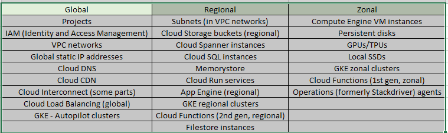
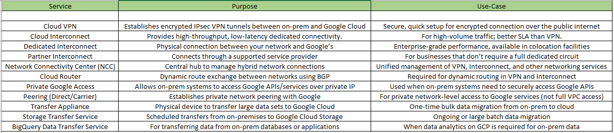

How the Resource Hierarchy Structure is managed into the Google Cloud Account?

Creating a new organization in Google Cloud Platform (GCP) isn't as straightforward as creating a project or account—it requires a Google Workspace (formerly G Suite) or Cloud Identity account.

Google Workspace has two editions:

1. Google workspace business editions
   
2. Schools and nonprofits
   

Google Cloud Identity:

1. Cloud Identity Free—You need your company's domain name and the admin username and password to your domain registrar to get started.
2. Cloud Identity Premium—You need your company's domain name to get started, or you need to purchase a domain during sign-up.

A. Your cloud identity account only have one organization and all projects and resources belongs to that organization instead of the employee who creates them.

B. You can consider the Organization as 'Master Resource' representing your company.

C. Permissions flow from the Organization as well.

D. It has super admin permission and visibility into all resources and audit logs.
This helps prevent projects without oversight.

E. The cloud IAM lets you control who has what access to which resources, you can set the cloud IAM policy at the organization level, folder level and at the end of the resources at resource level.

D. We need to add Folder Creator and Project Creator roles to your personal account.

===

Folders: Folders are an additional grouping mechanism on top of projects.

● Folders can be used to identify your departments or various environments of your cloud space. (Example: Environments like Production, Staging, Development, Staging etc.)
● A folder can contain projects, other folders, or a combination of both. Organization resources can use folders to group projects under the organization resource node in a hierarchy.

How to Use folders in cloud resource manager?
==> Folders help you organize and control GCP resources.

1. To get start with folders, make sure you have been assigned the folder creator or folder admin role.

Create folders in 3 steps:

1. Choose where to create folders in the GCP organization.
2. Create folders and define permissions.
3. Move project into folders.

Everything is handled in the IAM by clicking on the Manage Resources.

===

Projects:
● The project resource is the base-level organizing entity.
● Organizations and folders may contain multiple projects.
● Google Cloud projects form the basis for creating, enabling, and using all Google Cloud services including managing APIs, enabling billing, adding and removing collaborators, and managing permissions for Google Cloud resources.

The following are used to identify your project:

1. Project name: A human-readable name for your project.
   The project name isn't used by any Google APIs. You can edit the project name at any time during or after project creation. Project names do not need to be unique.

2. Project ID: A globally unique identifier for your project.
   A project ID is a unique string used to differentiate your project from all others in Google Cloud. After you enter a project name, the Google Cloud console generates a unique project ID that can be a combination of letters, numbers, and hyphens.

3. Project number: An automatically generated unique identifier for your project.
   Don't include sensitive information such as personally identifiable information (PII) or security data in your project name, project ID, or other resource names. The project ID is used in the name of many other Google Cloud resources, and any reference to the project or related resources exposes the project ID and resource name.

===

Regions: Regions are independent geographic areas that consist of zones.

1. Isolated from other regions
2. Transfer fee for data between regions. (It acquires data transfer charges)
3. Multi regional design can be used for fault tolerance.
4. Fault tolerance: Fault tolerance refers to a system's ability to continue operating correctly despite the occurrence of faults or failures.
5. Regions are collections of zones. Zones have high-bandwidth, low-latency network connections to other zones in the same region

Zones: A zone is a deployment area within a region. The fully-qualified name for a zone is made up of <region>-<zone>. For example, the fully qualified name for zone a in region us-central1 is us-central1-a.

● Isolated from other zones
● Low latency connection between AZ within the region.
● Zonal resources operate within a single zone. If a zone becomes unavailable, all
of the zonal resources in that zone are unavailable until service is restored.

Quotas:
Certain resources, such as static IPs, images, firewall rules, and VPC networks, have defined project-wide quota limits and per-region quota limits. When you create these resources, it counts towards your total project-wide quota or your per-region quota, if applicable. If any of the affected quota limits are exceeded, you won't be able to add more resources of the same type in that project or region.

For example, if your global target pools quota is 50 and you create 25 target pools in example-region-1 and 25 target pools in example-region-2, you reach your project-wide quota and won't be able to create more target pools in any region within your project until you free up space. Similarly, if you have a per-region quota of 7 reserved IP addresses, you can only reserve up to 7 IP addresses in a single region. After you reach that limit, you will either need to reserve IP addresses in a new region or release some IP addresses.

You choose which region or zone hosts your resources, which controls where your data is stored and used. Choosing a region and zone is important for several reasons:

1. Handling failures:
   Distribute your resources across multiple zones and regions to tolerate outages. Google designs zones to minimize the risk of correlated failures caused by physical infrastructure outages like power, cooling, or networking. Thus, if a zone becomes unavailable, you can transfer traffic to another zone in the same region to keep your services running.

2. Decreased network latency:
   To decrease network latency, you might want to choose a region or zone that is close to your point of service. For example, if you mostly have customers on the East Coast of the US, then you might want to choose a primary region and zone that is close to that area and a backup region and zone that is also close by.

===

On-Premises: Your organisation private data centre.

● Why chose cloud over the on premises?
==> 1. Cost Savings:
Cloud solutions often involve a pay-as-you-go model, eliminating large upfront hardware costs and associated maintenance expenses. Businesses only pay for the resources they consume, leading to more predictable and potentially lower monthly costs. 2. Flexibility and Scalability:
Cloud platforms enable businesses to easily adjust their resources up or down based on fluctuating demands, without the need for extensive planning or capital investments. This agility allows businesses to adapt quickly to changing market conditions. 3. Accessibility and Collaboration:
Cloud services provide universal access to data and applications from any location with an internet connection, facilitating remote work and seamless collaboration among geographically distributed teams. 4. Reduced Infrastructure Management:
With cloud, businesses don't have to manage their own data centers or servers, freeing up internal resources and reducing the burden of infrastructure upkeep.
Automatic Updates and Security:
Cloud vendors handle software updates and security patches, ensuring that businesses have access to the latest versions and security enhancements.

● How to connect to cloud through on premises?
==>
Connecting an on-premises network to a cloud environment like AWS, Google Cloud, or Azure can be achieved through various methods, including VPN tunnels, direct connections, or hybrid solutions. These methods offer different levels of security, performance, and cost.

1. VPN Tunnels:
   How it works:
   VPN tunnels create encrypted connections over the public internet, allowing secure data transfer between your on-premises network and the cloud.
   Tools:
   Cloud providers offer VPN services like Cloud VPN (Google Cloud), Virtual Private Gateway (AWS), and Site-to-Site VPN (Azure).
   Pros:
   Secure, cost-effective for smaller organizations or non-critical applications.
   Cons:
   Can be slower and less reliable than direct connections due to reliance on the internet

2. Direct Connections:
   How it works: Direct connections establish dedicated physical links between your on-premises network and the cloud provider's network, bypassing the public internet.
   Tools: Cloud providers offer services like AWS Direct Connect and Google Cloud Interconnect.
   Pros: Higher bandwidth, lower latency, and more reliable than VPN tunnels.
   Cons: More expensive and requires more technical expertise to set up.

3. Hybrid Solutions:
   How it works:
   Combines VPN tunnels and direct connections to leverage the strengths of both approaches.
   Tools:
   Hub and Spoke design can be used, where a central hub in the cloud connects to the on-premises network, and managed tenants connect to the hub.
   Pros:
   Provides a flexible and scalable solution for connecting on-premises networks to multiple cloud environments.
   Cons:
   Requires more planning and management.

In summary, the best way to connect on-premises to the cloud depends on your specific needs, budget, and technical expertise. Consider VPN tunnels for cost-effective and secure connections, direct connections for higher bandwidth and performance, or hybrid solutions for flexibility and scalability.

