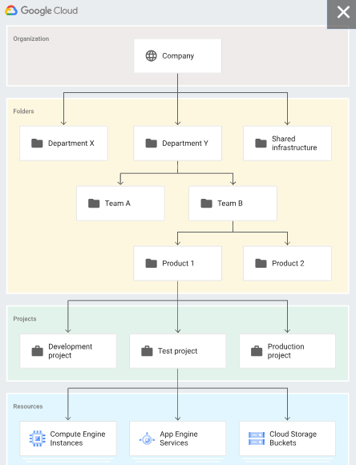
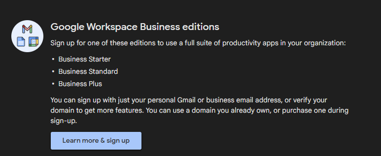
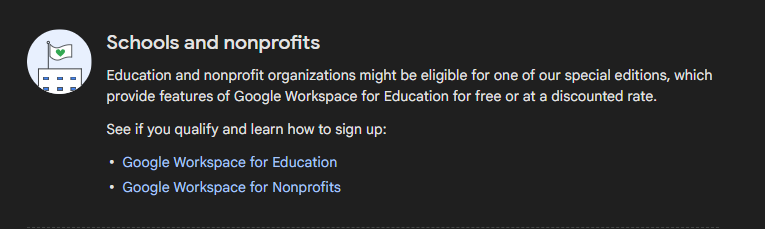
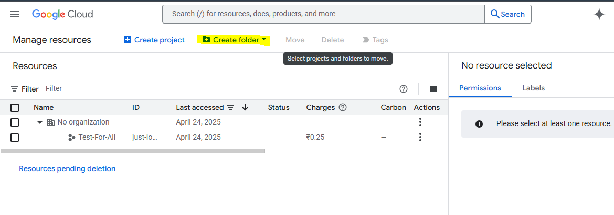

How the Resource Hierarchy Structure is managed into the Google Cloud Account?

Creating a new organization in Google Cloud Platform (GCP) isn't as straightforward as creating a project or account—it requires a Google Workspace (formerly G Suite) or Cloud Identity account.

Google Workspace has two editions:

1. Google workspace business editions
   
2. Schools and nonprofits
   

Google Cloud Identity:

1. Cloud Identity Free—You need your company's domain name and the admin username and password to your domain registrar to get started.
2. Cloud Identity Premium—You need your company's domain name to get started, or you need to purchase a domain during sign-up.

A. Your cloud identity account only have one organization and all projects and resources belongs to that organization instead of the employee who creates them.

B. You can consider the Organization as 'Master Resource' representing your company.

C. Permissions flow from the Organization as well.

D. It has super admin permission and visibility into all resources and audit logs.
This helps prevent projects without oversight.

E. The cloud IAM lets you control who has what access to which resources, you can set the cloud IAM policy at the organization level, folder level and at the end of the resources at resource level.

D. We need to add Folder Creator and Project Creator roles to your personal account.

===

Folders: Folders are an additional grouping mechanism on top of projects.

● Folders can be used to identify your departments or various environments of your cloud space.
● A folder can contain projects, other folders, or a combination of both. Organization resources can use folders to group projects under the organization resource node in a hierarchy.

How to Use folders in cloud resource manager?
==> Folders help you organize and control GCP resources.

1. To get start with folders, make sure you have been assigned the folder creator or folder admin role.

Create folders in 3 steps:

1. Choose where to create folders in the GCP organization.
2. Create folders and define permissions.
3. Move project into folders.

Everything is handled in the IAM by clicking on the Manage Resources.

===
