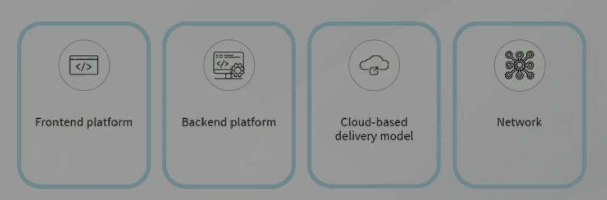
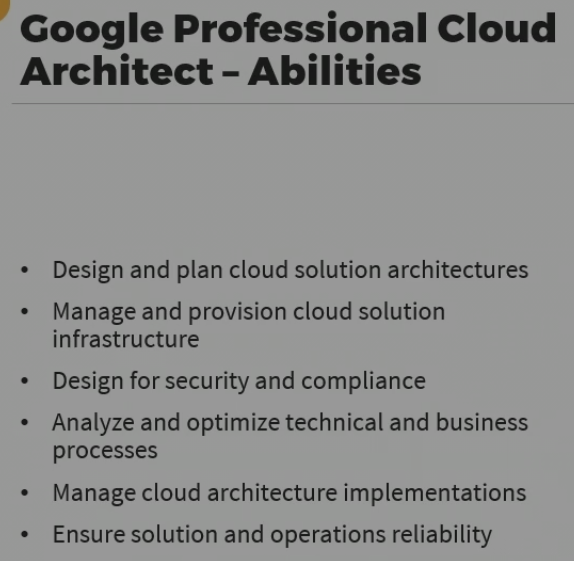
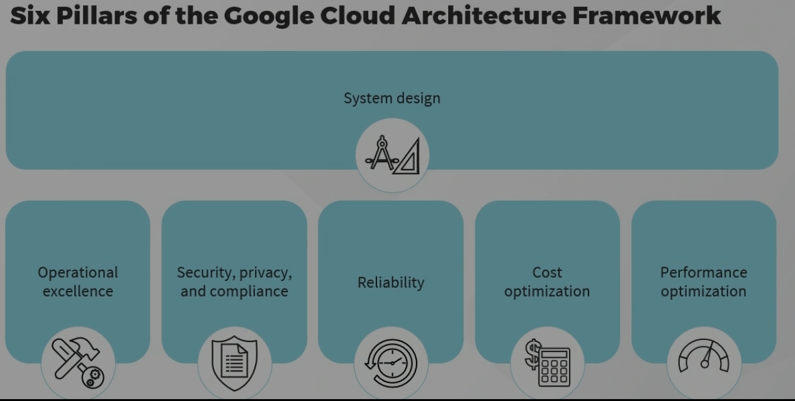

The roles and responsibilities of Google cloud architect which involves the following aspects:
At very high level these components involve

1. FrontEnd Platform : which provides users with any given solutions, such as browsers, mobile device apps, and method to provide authentication and authorization.
2. Backend Platform: which consists the infrastructure necessary to host the solution, such as Virtual machines and data storage.
3. Cloud-Based delivery model: which allows an organization to formulate execution startegies based on their needs, for example, which cloud models are required for the solution such as infrastructure as service (IaaS), Platform as a Service (PaaS), Software as a Service (SaaS)
4. Network: All networking and connectivity requirements such as load balancers, firewalls and virtual private cloud or VPCs.

One of the Primary responsibility of Cloud Architect is

1. Translate technical requirements into design and architecture. A design that will guide the development of the solution, much like architect of building provides blueprints of what needs to be constructed, but that blueprint must meet all the requirements that have been determined. The architect must have clear understanding of what those requirements are.

2. Close the gaps between business requirements and cloud solutions:
   Implement the solutions in the cloud.

3. Communicate and co-ordinate with other technical team members: including developers, administrators, and Devops engineers. Therefore, effective communication and coordination is also key aspect of designing any solution.

Other Aspects also involved such as:

1. Adoption Planning: Particularly when any organization not including any cloud providers. In which fundamental cultural shift for any organization which involves changing infrastructure, changing employee roles and procedures.

2. Cloud migration strategies: A cloud migration strategies that aligns with the business objectives of the organization, which can include selecting the appropriate cloud provider, implementing a disaster and recovery plan, and even a rollback plan in the event of the migration fails or if it turns out that a different provider is needed. After migration.

3. Development and Management: which can span many areas of technology including application development, data management, networking and identity and access management. (IAM) and once the solution is design and implemented then

4. Monitoring and Maintenance: to ensure the solution continues to perform as expected and deliver its services reliably.

The architect must be:

1. Cloud technology experties
2. Networking knowledge : TCP/IP, Addressing, DNS, HTTP and HTTPS.
3. OS and Software Proficiency: The proficiency in at least one major operating system such as Linux and it's flavours.
4. Programming language understanding: Scripting would be beneficial for automation.

Other than technical, other skillset must include:

1. Leadership qualities : Particularly for Organization and Planning.
2. Vision: A clear vision of the project requirements as well as the business direction of the organization to ensure that the solution enables the business move forward.
3. Collaboration: Many individuals and teams are often required to fully implement the solution. Ability to coordinate and collaborate activities amongst all those involved can be critical and as can clear communication, particularly it comes to interacting with stakeholders or decision makers who may not have technical background and change management through out the organization, again the organization is new to the cloud.

Other responsibilities also includes:

1. Cloud based Application architecture and integration
2. Big data
3. Budgeting and finance
4. Governance
5. Infrastructure as a code (IAC) proficiency.
6. Orchestration
7. Security and
8. Virtualization

===

Google cloud architecture framework.

There are 6 Pillars of Google Cloud Architecture Framework:

1. System design:
   Architecture modules, components, modules, interfaces and data.
   Solution Requirement.
   Google cloud products and features supporting system design.

2. Operational Excellence:
   Operational excellence guides you with respect to how to operate solutions and services in Google cloud as effectively and efficiently as possible.
   It also describes best practices that addresses deployments, including automated deployments, setting up monitoring, alerting and logging.
   And ongoing management with respect to estimated capacity of the solution and handling the peak traffic as well as establishing the support and escalation processes.

3. Security, privacy and compliance:
   It provides products and features to help ensures that your solutions operate securely while meeting the requirements of data and workload security.
   Design for the privacy for those who will be using and consuming the application.
   Also, aling with any regulatory or compliance requirement that might oversee your operations.
   Now, this can be an especially important aspect of solution development,particularly if an existing on-premises solution is being migrated to the cloud, in which case there can be concerns for aspects of the solution such as the placement of the data, encryption of data and communications and resource access that may not have been a concern, or at least not as much as concern as when the application was hosted internally.

4. Reliability component outlines that the methods and services are available in the Google cloud to help ensures that your applications are designed to be resillient or able to self-heal whenever possible and highly available.
   Also ensures that disaster recovery plan is in place.
   It also addresses the need for change management and establishing the reliability goals, against which matrix can be gathered to identify any deviations from those goals or reveal aspects of the solution where improvements can be made

5. Cost optimization: It is as much as sounds, it generally ensures that they are maximizing the business value of investment in Google Cloud.
   It is considered especially when there is on-premise resource migration or any organization is new to the cloud because the cost structure of cloud is so different from what it is internally. for example, including compute resoruces such as Virtual machines or containers, storage and databases, analytics,networking and general operations.
   It also provide tools and best practices to monitor and control cost on an on going basis, as well as adopting strategies to help encourage architects, developers and administrators to always consider the cost impact when provisioning the new solutions and resources.

6. Performance Optimization:
   Design and tune cloud resources for optimal performance.
   Provides high scalability and performance to the resources which are highly operable during the service.

===

System Design in the Google Cloud Architecture Framework:

1. Apply core principles of system design such as:
   Security, Reliability, Scalability and Independence. All of which facilitate to produce a solution that allows for iterative yet reversible changes without disrupting the system as whole.
2. Simplify your design as much as possible.
3. Determining which cloud resources are necessary to support that solution.
4. Choose and manage compute platform
5. Design your network infrastructure ensure secure communications with both internal and external services. How various components are communicate with each other and where they can be placed. for example, some components might require global services or other might require regional components specific to region.
6. Select and implement the storage strategy
7. Storage solutions should also consider the estimated workload, input/output operations per seconds or IOPS, latency, retreival frequency, location and capacity.
8. Optimize your database: Including database design, selecting an appropriate platform, handling migration, implementing scalability, encrypting database information, managing licensing and monitoring for events.
9. Analyze your data to generate actionable insights from that data. Reports and Visualizations, most of the services are fully managed which helps to reduce complexity and reliance on other managed services.
10. Implement machine learning for key AI and machine learning services, and how that can help during the various stages of the solutions life cycle.
11. Design your cloud workloads for sustainability by providing guidance and how to minimize your carbon footprint when using Google cloud, such as by hosting your solution in region with lower carbon emissions.
